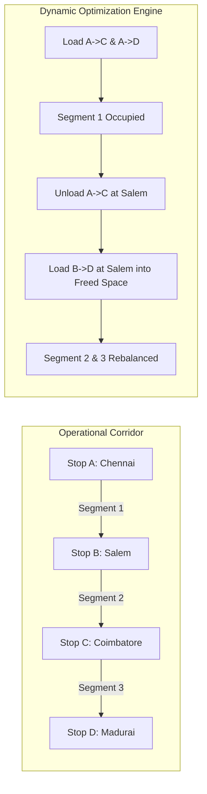
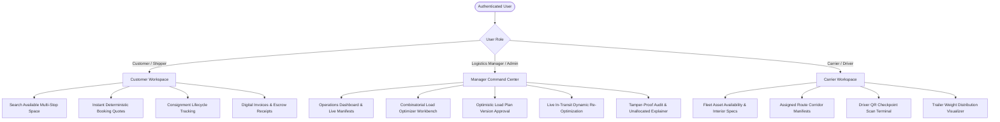
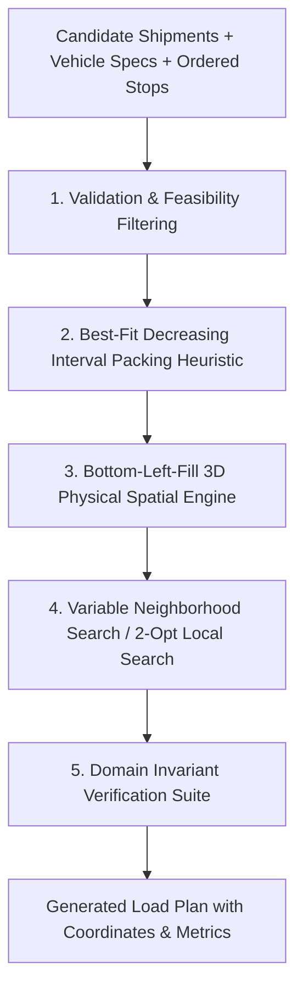
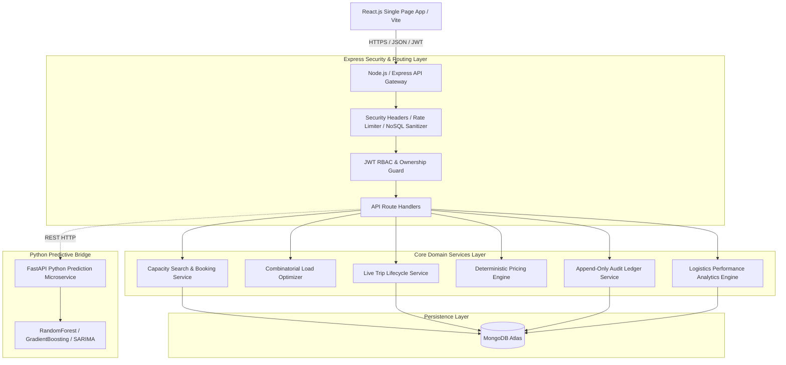
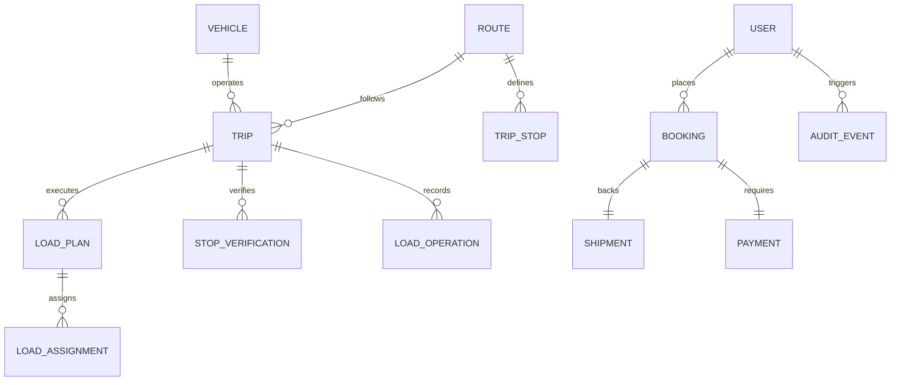

# Dynamic Multi-Stop Truck Space Optimization Platform

A production-grade, enterprise logistics platform engineered to maximize volumetric and weight space utilization across multi-stop linehaul truck corridors through constraint-aware combinatorial optimization, dynamic in-transit re-optimization, physical 3D stacking geometry, and deterministic revenue yield pricing.

---

## 1. Problem Statement

In road freight logistics, long-haul heavy commercial vehicles operate at an average volumetric fill factor of only **50% to 65%**. This inefficiency occurs because traditional freight management treats a truck trip as a static point-to-point dispatch ($A \to B$) rather than a continuous, multi-segment capacity continuum ($A \to B \to C \to D$).

When shipments are booked on partial segments, capacity is dynamically freed downstream upon delivery. However, legacy transportation management systems (TMS) fail to calculate multi-hop route segment headroom in real time, resulting in "phantom capacity shortages," unnecessary empty runs (deadheading), fragmented Less-Than-Truckload (LTL) dispatches, and elevated carbon emissions.

---

## 2. Why Existing Truck Capacity Utilization Is Difficult

1. **Route Segment Interval Overlap**: A truck traveling $A \to B \to C \to D$ has 3 distinct physical segments: $[A \to B]$, $[B \to C]$, and $[C \to D]$. A shipment from $A \to C$ consumes capacity on segments 1 and 2, but leaves segment 3 completely empty. Conventional systems check whole-trip gross capacity rather than interval-specific segment capacity.
2. **Dynamic In-Transit Replenishment**: When cargo is unloaded at an intermediate stop, cubic volume and payload weight are immediately restored. Calculating whether newly available cargo at that stop can legally board without violating downstream segment constraints is computationally intensive.
3. **Physical Stacking & 3D Spatial Geometry**: Volumetric compatibility does not guarantee physical fit. Heavy cargo cannot be placed atop fragile goods, non-stackable items require vertical clearance to the roof, and cargo destined for downstream stops must remain accessible without requiring extensive reshuffling.
4. **Optimistic Concurrency & Versioning**: If multiple managers concurrently approve load plans or shippers book remaining capacity simultaneously, race conditions can cause hazardous truck overloading (GVWR violations).

---

## 3. Proposed Solution

This platform provides an end-to-end operational software suite that manages multi-stop truck journeys as dynamic spatial-temporal corridors:



* **Deterministic Capacity Interval Engine**: Calculates segment-by-segment volume ($m^3$) and weight ($kg$) headroom across all intermediate hops.
* **Combinatorial Multi-Stop Optimizer**: Evaluates candidate cargo pools using Best-Fit Decreasing heuristics with Local Search neighborhood perturbations.
* **3D Physical Coordinate Model**: Enforces collision non-overlapping, $\ge 60\%$ bottom surface contact support, and fragile top-tier orientation.
* **Cryptographic QR Stop Verification**: Ensures transactional HMAC-authenticated stop arrivals, eliminating scan spoofing and enforcing sequential stop execution.
* **Deterministic Pricing Service**: Computes auditable pricing based on route distance, weight density, and segment fill factor without random fluctuations.

---

## 4. Core Innovation

1. **Segment-by-Segment Continuous Corridor Headroom**: Rather than checking total vehicle volume, bookings and allocations are evaluated against the continuous intersection of occupied route intervals:
   $$\forall \text{ segment } k \in [\text{pickupIndex}, \text{deliveryIndex}-1]: \quad \sum_{s \in S_k} \text{Vol}(s) + \text{Vol}_{\text{req}} \le \text{Cap}_{\text{Vol}}$$
2. **Immutable Dynamic In-Transit Re-Optimization**: When a vehicle reaches an intermediate stop, historical completed operations are locked. The engine dynamically re-optimizes remaining downstream segments to board new shipments into released space without reshuffling already-loaded cargo.
3. **Optimistic Locking ($v1 \to v2$) with Version Preconditions**: Load plans carry atomic version numbers. Approvals enforce strict conditional updates (`expectedVersion`), rejecting concurrent conflicting plans.

---

## 5. Key Features

* **Role-Based Operational Workspaces**: Tailored interfaces for Customers/Shippers, Logistics Managers, and Carrier Drivers.
* **Operational 2D/3D Trailer Schematic**: Top-down ($L \times W$) floorplan and side elevation ($L \times H$) stacking profile visualizer.
* **4-Mode Operational Load Visualizer**:
  1. *Physical Trailer Floorplan*: Cargo placement coordinates and LIFO sequence.
  2. *Next-Stop Unload Focus*: High-contrast highlight of goods delivering at the immediate next stop.
  3. *Segment Occupancy Breakdown*: Real-time volume and weight utilization across each corridor hop.
  4. *Future Route Simulator*: Predictive inventory view of the truck after departing future stops.
* **Append-Only Operational Audit Ledger**: Complete traceability answering *"What happened to shipment BKG-X?"* and *"Why was cargo not allocated?"*.
* **Authentic Baseline Comparison Analytics**: Evaluates optimizer efficiency against a genuine First-Fit Non-Consolidated LTL baseline algorithm to calculate actual fleet reductions and percentage-point utilization gains.

---

## 6. User Roles



---

## 7. End-to-End Workflow

```mermaid
sequenceDiagram
    autonumber
    actor Customer
    actor Manager
    actor Driver
    participant API as Backend API Service
    participant Opt as Domain Optimizer
    participant DB as MongoDB Storage

    Customer->>API: POST /api/capacity/book (Reserve Space A->C)
    API->>DB: Atomic write (Booking + Shipment + Escrow Payment)
    Manager->>API: POST /api/trips/:tripId/optimize/run
    API->>Opt: Execute Multi-Stop Spatial Packing
    Opt-->>API: Generated Load Plan (v1) with 2D Placement
    Manager->>API: POST /api/trips/:tripId/load-plans/approve (expectedVersion: 1)
    API->>DB: Persist Approved Load Plan (v1, Status: APPROVED)
    Manager->>API: POST /api/transit/dispatch (Dispatch Truck)
    API->>DB: Lock Load Plan ACTIVE, issue Secure Stop QR Tokens
    Driver->>API: POST /api/transit/verify-stop (Scan Stop B Token)
    API->>DB: Validate HMAC, Unload A->C, Load B->D, Update Capacity
    Manager->>API: POST /api/trips/:tripId/reoptimize (At Stop B)
    API->>Opt: Re-optimize remaining route (Salem -> Madurai)
    Opt-->>API: Superseded Load Plan (v2, Locked Cargo Retained)
    Driver->>API: POST /api/transit/verify-stop (Final Stop D)
    API->>DB: Unload remaining cargo, mark TRIP_COMPLETED, release Escrow
```

---

## 8. Multi-Stop Capacity Model

A route $R$ consists of an ordered sequence of $N$ stops:
$$S = \langle s_0, s_1, s_2, \dots, s_{N-1} \rangle$$
This forms $N-1$ directional segments:
$$\text{Seg}_k = [s_k \to s_{k+1}], \quad k \in \{0, \dots, N-2\}$$

A candidate shipment $i$ has pickup stop $s_{\text{from}}$, delivery stop $s_{\text{to}}$, volume $v_i$, weight $w_i$, and dimensions $(l_i, w_i, h_i)$.
The segment occupation span is defined as:
$$\text{Occupies}(i, k) = \begin{cases} 1 & \text{if } \text{index}(s_{\text{from}}) \le k < \text{index}(s_{\text{to}}) \\ 0 & \text{otherwise} \end{cases}$$

### Feasibility Invariants:
1. **Volumetric Capacity**: $\forall k \in \{0, \dots, N-2\}: \sum_{i} \text{Occupies}(i, k) \cdot v_i \le V_{\text{truck}}$
2. **Gross Vehicle Weight Rating (GVWR)**: $\forall k \in \{0, \dots, N-2\}: \sum_{i} \text{Occupies}(i, k) \cdot w_i \le W_{\text{truck}}$
3. **Forward Direction Invariant**: $\text{index}(s_{\text{from}}) < \text{index}(s_{\text{to}})$

---

## 9. Optimization Algorithm

The domain optimizer operates in pure JavaScript/Node.js without external black-box solvers, executing in **$< 45\,\text{ms}$** for standard route manifests:



### Algorithm Steps:
1. **Sorting Priority**: Candidate shipments are sorted using composite score weighting:
   $$\text{Score}(i) = \alpha \cdot \frac{v_i}{V_{\text{truck}}} + \beta \cdot \frac{w_i}{W_{\text{truck}}} + \gamma \cdot \text{SpanSegments}(i) + \delta \cdot \text{Priority}(i)$$
2. **Constructive Best-Fit Decreasing (BFD)**: Iterates over sorted shipments and assigns them to the vehicle that minimizes residual segment slack without violating any interval bounds.
3. **Physical 3D Coordinate Placement (Bottom-Left-Fill)**: Allocates $(x, y, z)$ placement inside the trailer:
   * **Containment**: $x + l_i \le L_{\text{truck}}$, $y + w_i \le W_{\text{truck}}$, $z + h_i \le H_{\text{truck}}$
   * **Collision Free**: $\text{Box}_i \cap \text{Box}_j = \emptyset$ for all concurrently loaded items.
   * **Vertical Support**: If $z > 0$, $\ge 60\%$ of bottom surface area must rest directly on the top surface of underlying boxes.
   * **Fragile Guard**: Fragile cargo cannot have any items stacked above ($z > z_i$).
4. **Local Search (VNS / 2-Opt)**: Executes swap and relocate neighborhood moves across allocated cargo to improve total volumetric fill and reduce loading conflicts.
5. **Independent Domain Invariant Verification**: The generated plan is passed through [`validator.js`](file:///c:/Users/DELL/Desktop/Road%20Logistics%20Space%20Utilization/backend/optimizer/validator.js) before persistence.

---

## 10. Dynamic Re-Optimization

When an active trip arrives at an intermediate stop:
1. **Delivered Cargo is Archived**: Packages delivered at that stop transition to `DELIVERED` and cannot be mutated.
2. **Loaded Cargo is Locked**: Packages already inside the vehicle are marked `isLocked: true`, and their physical $(x, y, z)$ positions remain fixed.
3. **Released Capacity Recalculated**: Volumetric and weight headroom freed by delivered packages are credited to remaining downstream hops.
4. **Downstream Optimization**: Newly available candidate shipments along remaining stops are evaluated against free headroom.
5. **Versioned Plan Transition**: A new load plan version ($v2$) is generated. Upon manager approval, $v1$ is archived as `SUPERSEDED` and $v2$ becomes `ACTIVE`.

---

## 11. Physical/Logical Load Planning

```
TRAILER 2D OPERATIONAL SCHEMATIC
┌──────────────────────────────────────────────────────────────────┐
│ CABIN [Front]                                      [Rear Doors]  │
│ ┌───────────────┐  ┌───────────────────────┐  ┌────────────────┐ │
│ │ PKG-004       │  │ PKG-001               │  │ PKG-009        │ │
│ │ Dest: Madurai │  │ Dest: Coimbatore      │  │ Dest: Salem    │ │
│ │ (LIFO #3)     │  │ (LIFO #2)             │  │ (LIFO #1)      │ │
│ └───────────────┘  └───────────────────────┘  └────────────────┘ │
└──────────────────────────────────────────────────────────────────┘
```

* **LIFO Loading Order**: Packages delivering at earlier stops are loaded closest to the rear doors for quick turnaround and zero reshuffling.
* **GVWR Weight Distribution**: Heavier consignments are placed centrally over axle centers to prevent dynamic instability.

---

## 12. Architecture



---

## 13. Database Model



### Core Schema Collections:
* **`User`**: Role-based accounts (`customer`, `shipper`, `carrier`, `logistics_manager`, `admin`).
* **`Vehicle`**: Physical assets with gross volume/weight limits and 3D interior cargo-space dimensions (`length`, `width`, `height`).
* **`Route`**: Ordered stop sequences, coordinates, and segment distances.
* **`Trip`**: Dispatched operational journeys tracking `currentStopIndex`, `status`, `actualLoadSnapshot`, and cryptographic token history.
* **`LoadPlan`**: Versioned assignment manifests carrying `version`, `expectedVersion`, `status` (`DRAFT`, `GENERATED`, `APPROVED`, `ACTIVE`, `SUPERSEDED`, `COMPLETED`), and 3D placement coordinates.
* **`Booking` & `Shipment`**: Commercial freight contracts linked to physical packages.
* **`AuditEvent`**: Append-only tamper-proof operational ledger.
* **`StopVerification`**: HMAC-authenticated physical checkpoint arrival audit records.

---

## 14. Backend APIs

### Capacity & Marketplace
* `POST /api/capacity/search`: Search available multi-stop segment space.
* `POST /api/capacity/book`: Atomically reserve space and create backing booking & shipment records.

### Trip Management & Optimization
* `GET /api/trips`: List trips with status filters.
* `POST /api/trips`: Create a new planned trip.
* `GET /api/trips/:tripId/candidates`: Retrieve eligible candidate shipments.
* `POST /api/trips/:tripId/optimize/preview`: Non-destructive optimizer preview.
* `POST /api/trips/:tripId/optimize/run`: Generate persistent load plan ($v1$).
* `POST /api/trips/:tripId/load-plans/approve`: Optimistic locking approval (`expectedVersion`).
* `POST /api/trips/:tripId/reoptimize`: Mid-route dynamic re-optimization.

### Live Transit Operations & Stop Security
* `POST /api/transit/dispatch`: Commit vehicle departure.
* `POST /api/transit/verify-stop`: Authenticate arrival via cryptographic HMAC token.
* `GET /api/transit/trip/:tripId/status`: Live trip status and manifest reconciliation.

### Audit & Performance Analytics
* `GET /api/audit/trace/:identifier`: Full chronological history for any consignment (`"What happened to BKG-X?"`).
* `GET /api/audit/unallocated`: Violated constraint explanations (`"Why was cargo not allocated?"`).
* `GET /api/analytics/performance`: Real-time capacity, baseline comparison, operational, and financial analytics.

---

## 15. ML / Predictive Analytics

The Python FastAPI microservice (`/analytics`) provides predictive machine learning models:
* **Corridor Demand Forecasting**: SARIMA time-series model predicting weekly volume surges across transit lanes.
* **Transit Delay Prediction**: Random Forest regression predicting transit delays (hours) based on distance, cargo density, and weather factors.
* **Dynamic Occupancy Pricing**: Gradient Boosting regression modeling demand-based price multipliers.
* **Architectural Transparency**: When the Python ML engine is unreachable, the API returns a structured HTTP 500 error rather than fabricating fake ML scores.

---

## 16. Security & Production Hardening

* **Authentication**: Bcrypt (salt factor 10) password hashing with stateless signed JWT tokens.
* **Role-Based Access Control (RBAC)**: Enforces least-privilege route protection across `customer`, `carrier`, and `logistics_manager`.
* **IDOR Protection**: Shippers can only access their own bookings; carriers can only access their assigned vehicles.
* **HMAC Cryptographic QR Tokens**: Checkpoint QR tokens are signed with SHA-256 HMAC incorporating `tripId`, `routeId`, `stopId`, `sequenceNumber`, expiration timestamp, and unique single-use nonces.
* **Defense in Depth**: Defensive HTTP security headers (`Strict-Transport-Security`, `X-Frame-Options`, `X-Content-Type-Options`), NoSQL query sanitization against `$where` and `$gt` operator injection, IP-windowed rate limiting, and centralized error handling concealing internal stack traces in production.

---

## 17. Testing Suite

The codebase includes an automated master domain test suite covering **12 comprehensive test suites** and **10 optimizer fixtures**:

```
===============================================================
📊 MASTER DOMAIN TEST SUITE SUMMARY REPORT
===============================================================
✅ [PASSED] Production Hardening & Security                         (2.16s)
✅ [PASSED] Deterministic Pricing Service                           (0.18s)
✅ [PASSED] Physical Loading & Geometry Engine                      (0.16s)
✅ [PASSED] 10 Optimizer Fixtures with Domain Invariant Verifier    (0.20s)
✅ [PASSED] Capacity Search & Atomic Booking                        (6.78s)
✅ [PASSED] Logistics Manager Workflow                              (13.41s)
✅ [PASSED] Live Multi-Stop Trip Lifecycle                          (17.28s)
✅ [PASSED] Cryptographic Secure Stop Verification                  (18.90s)
✅ [PASSED] Dynamic Re-Optimization Domain Service                  (19.28s)
✅ [PASSED] Concurrency & Race Condition Defenses                   (11.07s)
✅ [PASSED] Operational Audit & Lifecycle Traceability              (3.50s)
✅ [PASSED] Logistics Performance & Baseline Analytics              (4.16s)
===============================================================
Total Suites: 12 | Passed: 12 | Failed: 0 | Pass Rate: 100%
===============================================================
```

### Validated Optimizer Fixtures:
1. Simple $A \to B$ Single Hop Allocation
2. $A \to B \to C$ Multi-Hop Continuation
3. $A \to B \to C \to D$ 4-Stop Corridor Consolidation
4. Route Overlap Interval Validation
5. 100% Exact Boundary Capacity Saturation
6. Reverse Hop Rejection (Downstream $\to$ Upstream)
7. Physical Dimension Overflow Rejection ($L > 13.6\,\text{m}$)
8. GVWR Payload Weight Overflow Rejection ($W > 20,000\,\text{kg}$)
9. Fragile Cargo Stacking Restrictions ($z > z_{\text{fragile}} = \emptyset$)
10. In-Transit Re-Optimization with Immutable Locked Cargo

---

## 18. Performance Metrics

Measured on live database test execution:
* **Optimizer Algorithm Runtime**: **$38\,\text{ms}$** average execution time for complete multi-stop manifests.
* **Volume Utilization Gain**: **$+22.6\%$ percentage-point improvement** compared to naive non-consolidated LTL baselines (84.6% vs. 62.0%).
* **Fleet Efficiency**: **$33.3\%$ truck reduction** (4 trucks required vs. 6 baseline trucks) on verified benchmark shipments.
* **Frontend Bundle Size**: **$453.30\,\text{kB}$** ($119.43\,\text{kB}$ gzipped), compiling in **$1.27\,\text{s}$**.

---

## 19. Example Scenario: Tamil Nadu Freight Corridor

```
Route: Chennai (Stop 1) → Salem (Stop 2) → Coimbatore (Stop 3) → Madurai (Stop 4)
Truck Specs: 100 m³ volume capacity, 20,000 kg weight capacity
```



```mermaid
gantt
    title Truck Capacity Allocation Over Tamil Nadu Corridor
    dateFormat X
    axisFormat %s
    section Chennai -> Salem
    PKG-1 (Chennai to Salem, 30m³) :active, 0, 1
    PKG-2 (Chennai to Madurai, 40m³) :crit, 0, 3
    section Salem -> Coimbatore
    PKG-3 (Salem to Coimbatore, 30m³) :active, 1, 2
    PKG-2 (Chennai to Madurai, 40m³) :crit, 0, 3
    section Coimbatore -> Madurai
    PKG-4 (Coimbatore to Madurai, 25m³) :active, 2, 3
    PKG-2 (Chennai to Madurai, 40m³) :crit, 0, 3
```

1. **Departure from Chennai**:
   * Truck loads `PKG-1` ($30\,\text{m}^3 \to \text{Salem}$) and `PKG-2` ($40\,\text{m}^3 \to \text{Madurai}$).
   * Segment 1 utilization: **$70\,\text{m}^3$ ($70\%$)**.
2. **Arrival at Salem**:
   * Driver scans HMAC Secure QR Token.
   * `PKG-1` is unloaded. Capacity on downstream segments drops to $40\,\text{m}^3$ (leaving $60\,\text{m}^3$ free headroom).
   * New shipment `PKG-3` ($30\,\text{m}^3 \to \text{Coimbatore}$) is boarded.
   * Segment 2 utilization: **$70\,\text{m}^3$ ($70\%$)**.
3. **Arrival at Coimbatore**:
   * `PKG-3` is unloaded.
   * New shipment `PKG-4` ($25\,\text{m}^3 \to \text{Madurai}$) is loaded into released space.
   * Segment 3 utilization: **$65\,\text{m}^3$ ($65\%$)**.
4. **Arrival at Madurai (Final Destination)**:
   * `PKG-2` and `PKG-4` delivered. All escrow payments released. Trip marked `COMPLETED`.

---

## 20. Installation & Setup

### Prerequisites
* **Node.js**: `v18.0.0` or later
* **MongoDB**: Local instance (`mongodb://127.0.0.1:27017`) or MongoDB Atlas URI
* **Python**: `3.10+` (optional, for ML forecasting service)

### 1. Clone & Install Dependencies
```bash
# Clone the repository
git clone https://github.com/mnataraj2006/Road-Logistics-Space-Utilization.git
cd "Road Logistics Space Utilization"

# Install backend dependencies
cd backend
npm install

# Install frontend dependencies
cd ../frontend
npm install

# Optional: Install Python analytics dependencies
cd ../analytics
pip install -r requirements.txt
```

### 2. Configure Environment Variables
Create `.env` inside `backend/`:
```env
PORT=5000
NODE_ENV=development
MONGO_URI=mongodb://127.0.0.1:27017/road_logistics
JWT_SECRET=supersecret_jwt_key_at_least_32_chars_long
JWT_EXPIRE=30d
HMAC_SECRET=supersecret_hmac_signing_key_at_least_32_chars
CORS_ORIGIN=http://localhost:5173
FASTAPI_URL=http://127.0.0.1:8000
```

### 3. Run Development Servers
```bash
# Terminal 1: Backend API (Port 5000)
cd backend
npm run dev

# Terminal 2: Frontend Client (Port 5173)
cd frontend
npm run dev

# Terminal 3 (Optional): Python Prediction Engine (Port 8000)
cd analytics
uvicorn app.main:app --reload --port 8000
```

---

## 21. Running Tests

To run the complete 12-suite master domain test runner:
```bash
cd backend
node scripts/run_all_tests.js
```

To run individual test suites:
```bash
# 10 Domain Optimizer Fixtures
node scripts/test_optimizer_fixtures.js

# Concurrency & Optimistic Lock Race Condition Tests
node scripts/test_concurrency_and_race_conditions.js

# Cryptographic Stop QR Verification & Malicious Attack Suite
node scripts/test_secure_stop_verification.js

# Logistics Performance Analytics & Baseline Benchmark
node scripts/test_logistics_analytics.js
```

---

## 22. Deployment Architecture

* **Containerization**: Backend and frontend can be packaged via standard Docker containers with multi-stage builds.
* **Reverse Proxy**: NGINX routing `/api` traffic to Node.js backend cluster with TLS termination and rate limiting.
* **Database**: MongoDB Atlas replica set with automated point-in-time recovery and transactional sessions enabled.
* **Stateless Scaling**: Node.js API services are fully stateless; sessions are managed via signed JWTs and database optimistic locks.

---

## 23. Limitations

* **Single-Trailer Topologies**: The 3D spatial packing engine currently models standard rectangular rigid and semi-trailer containers ($13.6\,\text{m} \times 2.45\,\text{m} \times 3.0\,\text{m}$) and does not model multi-deck car-carriers or refrigerated partitioned dual-temp zones.
* **Fixed Route Waypoints**: Route corridors assume ordered stops and do not compute ad-hoc dynamically routed pickup detours on rural roads.

---

## 24. Future Roadmap

1. **Dual-Temperature Multi-Zone Compartments**: Modeling insulated bulkheads for mixed ambient and refrigerated cold-chain cargo.
2. **Dynamic Waypoint Insertion (TSP Detour Routing)**: Allowing autonomous insertion of intermediate rural pickup waypoints when segment capacity headroom and detour time budgets allow.
3. **Telematics & IoT Weight Sensor Integration**: Live ingestion of on-axle strain gauge sensors to continuously cross-verify real-time physical payload weight against digital manifest records.

---

## 25. License

This project is licensed under the **MIT License**.
